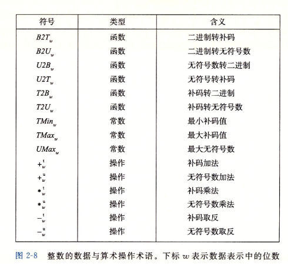

----
-title: CS-App 读书笔记（第二章）
-layout: blog
----

# CS-APP 读书笔记

## 摘录

### 信息存储

* **无符号**（unsigned）编码基于传统的二进制表示法，表示大于或这等于零的数字。**补码**（two's-complement）编码是表示有符号整数的最常见的方式，有符号整数就是可以为正或者为负的数字。**浮点数**（floating-point）编码是表示实数的科学计数法的以2为基数的版本。

* 计算机的表示法使用有限数量的位来对一个数字编码，因此，当结果太大以致不能表示时，某些运算就会溢出。
<!--more-->

* 大多数计算机使用8位的块，或者 **字节**（byte），作为最小的可寻址的内存单位，而不是访问内存中单独的位。机器级程序将内存视为一个非常大的数组，称为 **虚拟内存**（virtual memory）。内存的每个字节都由一个唯一的数字来标识，称为它的地址，所有可能地址的集合就称为 **虚拟地址空间**（virtual address space）。顾名思义，这个虚拟地址空间只是一个展现给机器级程序的概念性映像。实际的实现是将动态随即访问存储器（DRAM），闪存，磁盘存储器，特殊硬件和操作系统结合起来，为程序提供一个看上去统一的字节数组。

* C语言中一个指针的值（无论它指向一个整数，一个结构或是某个其他程序对象）都是某个存储块的第一个字节的虚拟地址。C编译器海拔每个指针和 **类型** 信息联系起来，这样就可以根据指针值的类型，生成不同的机器级代码来访问存储在指针所指向位置处的值。
 
* 每台计算机都有一个 **字长** ，指明指针数据的标称大小。因为虚拟地址是以这样的一个字来编码的，所以字长决定的最重要的系统参数就是虚拟地址空间的最大大小。也就是说，对一个字长为$w$位的机器而言，虚拟地址的范围为$0$~$2^{w}-1$，程序最多访问$2^w$个字节。（64位机器`sizeof(char *) //8`）

* 在几乎所有的机器上，多字节对象都被存储为连续的字节序列，对象的地址为所使用字节中最小的地址。

* 在内存中按照从最低有效字节到最高有效字节的顺序存储对象，称为 **小端法**（little endian）。 在内存中按照从最高有效字节到最低有效字节的顺序存储对象，称为 **大端法** （big endian）

* 位向量就是固定长度为$w$，由0和1组成的串。位向量的运算可以定义成参数的每个对应元素之间的运算。

* 位级运算的一个常见用法就是实现掩码运算，这里掩码是一个位模式，表示从一个字中选出的位的集合。

* 逻辑右移和算术右移。逻辑右移在左端补0，算术右移左端补最高有效位的值。

### 整数表示

* 在本节中，我们描述用位来编码整数的两种不同的形式：一种只能表示非负数，而另一种能够表示负数、零和整数。 

* C和C++都支持有符号（默认）和无符号数。Java只支持有符号数。

* **无符号数的编码**： 假设有一个整数数据有$w$位。我们可以将位向量写成$\vec{x}$，表示整个向量，或者写成$[x_{w-1},x_{w-2},...,x_0]$表示向量中的每一位。把$\vec{x}$看做一个二进制表示的数，就获得了$\vec{x}$的无符号表示。

* 我们用一个**函数$B2U_w$来将$\vec{x}$从二进制无符号数转化为十进制无符号数**，对向量$\vec{x}=[x_{w-1},x_{w-2},...,x_0]$:

$$
	B2U_w(\vec{x})=\sum_{i=0}^{w-1}x_i2^i
$$

* 无符号数编码的唯一性： 函数$B2U_w$是一个双射

* **补码编码**：最常见的有符号数的计算机表示方式就是**补码**（two's-complement）。在这个定义中，将字的最高有效位解释为**负权**。

* **补码编码的定义**，对向量$\vec{x}=[x_{w-1},x_{w-2},...,x_0]$:

$$
	B2T_w(\vec{x})=-x_{w-1}2^{w-1}+ \sum_{i=0}^{w-2}x_i2^i
$$

* 最高有效位$x_{w-1}$也成为符号位，它的权重为$-2^{w-1}$，是无符号表示中权重的负数。符号位被设置为1时，表示值为负，而当设置为0时，值为非负。

* 补码编码的唯一性： 函数$B2T_w$是一个双射。